# Master Thesis

---
---

# ZMQ Sockets

- ZMQ_REQ/ZMQ_REP
    - Send/Receiver order has to be respected
    - Reply remembers only last received address
- Other Sockets:
    - Push/Pull 
    - Pub/Sub 
    - Pair/Pair
    - Router/Dealer

<div 
    alt="WorkerSM"
    class="absolute top-15% left-50% right-0 bottom-0"
>

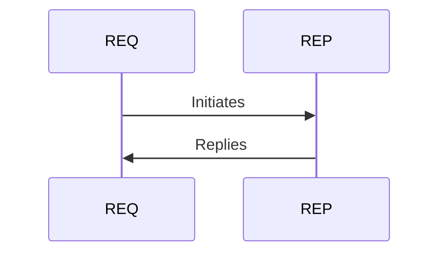
</div>

---
layout: two-cols-header
---

# Testbench and Heuristic


::left::
1. Allocate __N__ VMs.
2. Run Jasper on Vanilla Setup
    1. Terminate
    1. Store Results
3. Apply Proposed Heuristic


::right::

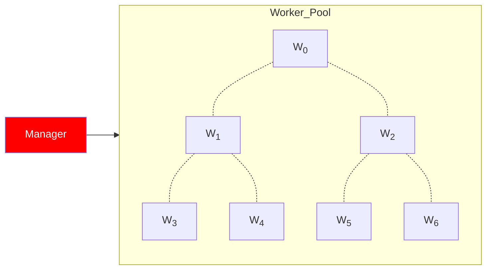

---
layout: two-cols-header
---

# Manager x Worker: Communication

- ZMQ Sockets
- Pairwise send and reply initiated by Manager
- Manager: ZMQ_REQ 
- Worker:  ZMQ_REP

::left::

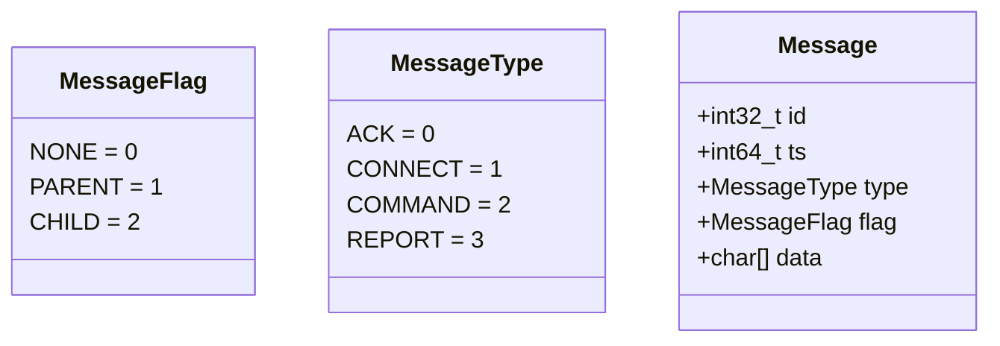

::right::

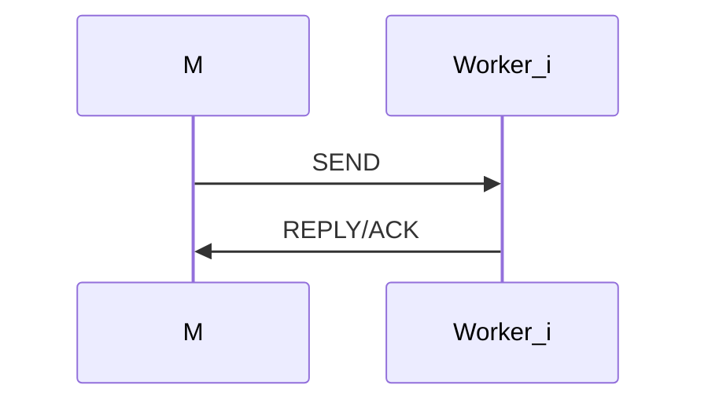

---
layout: two-cols-header
---

# Worker State Machine

- Workers are reply sockets
- Bind and block on `recv()`
- Process message based on type

::left::

```python
while(True):
    m = self.recv_message()
    match m.type:
        case CONNECT: self.connectACK(m)
        case COMMAND: self.commandACK(m)
        case REPORT:  self.reportACK(m)
        case _:       raise RuntimeError()

```

::right::


---
layout: two-cols-header
---

# Manager State Machine

- Manager actively sends requests to workers
- Fetches steps from `step_queue`
- Process steps based on action type

::left::

```python
while(True):
    step = self.pop_step()
    if not step: break
        match step["action"]:
            case "CONNECT": self.establish()
            case "ROOT":    self.root()
            case "REPORT":  self.report()
            case _:         raise RuntimeError()
```

::right::


---
layout: two-cols-header
---

# Manager x Worker: Workflow [i = 0]

- Manager reads in YAML _script_
- Populates step queue
- Fetches first step

<div
    alt="StepQ"
    style="transform: scale(0.6)"
    class="absolute top--5 left-30% right-0 bottom-0"
>

</div>

<div
    alt="Pool"
    style="transform: scale(0.6)"
    class="absolute top--5 left-60% right-0 bottom-0"
>

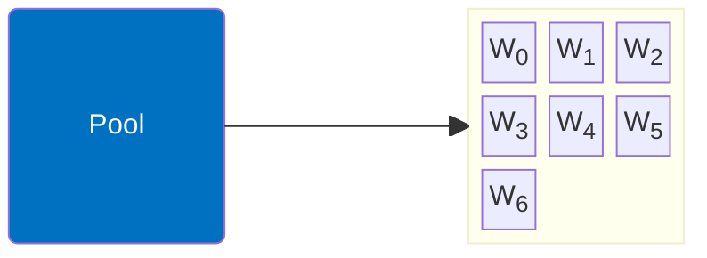
</div>

::left::

```yaml
name: DEFAULT
hyperparameter: 0.5
rate: 10 
duration: 10
addrs:
  - "localhost:9091"
  - "localhost:9092"
  - "localhost:9093"
  - "localhost:9094"
  - "localhost:9095"
  - "localhost:9096"
steps:
  - action: "CONNECT"
    description: "Establish connection workers."
    data: 0
  - action: "ROOT"
    description: "Choose root among worker nodes."
    data: 0
```

::right::


---
layout: two-cols-header
---

# Manager x Worker: Workflow [i = 1]

- <span style="color:#0070C0;font-style:bold;">ACTION: CONNECT</span>
1. Loops through all workers
    1. Establishes connection 
    2. Sends/Receives CONNECT/ACK Messages
    3. Disconnects

<div
    alt="StepQ"
    style="transform: scale(0.6)"
    class="absolute top--5 left-30% right-0 bottom-0"
>
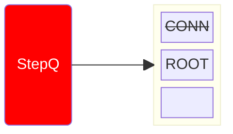
</div>

<div
    alt="Pool"
    style="transform: scale(0.6)"
    class="absolute top--5 left-60% right-0 bottom-0"
>


</div>

::left::

<div 
    alt="Message"
    style="transform: scale(0.8)"
>

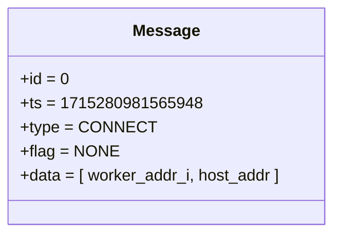

</div>

<div 
    alt="Seq"
    style="transform: scale(0.8)"
    class="absolute left-13% bottom-5%"
>

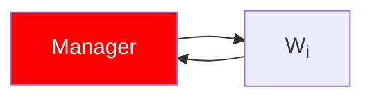

</div>

::right::


---
layout: two-cols-header
---

# Manager x Worker: Workflow [i = 2]

- <span style="color:#0070C0;font-style:bold;">ACTION: ROOT</span>
1. Select root from pool <span style="color:#FF0000; font-style:italic;">( idx=2 )</span>
2. Commands root to be _Parent_
3. Creates/Pushes: `Step=REPORT`

<div
    alt="StepQ"
    style="transform: scale(0.6)"
    class="absolute top--5 left-30% right-0 bottom-0"
>
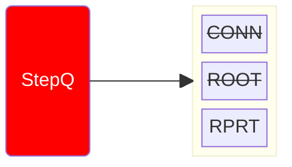
</div>

<div
    alt="Pool"
    style="transform: scale(0.6)"
    class="absolute top--5 left-60% right-0 bottom-0"
>

```mermaid
block-beta
    P("<font color=white>Pool ")
    space
    block:workers
        columns 3
        W0["W<sub>0</sub>"] 
        W1["W<sub>1</sub>"]
        W2["<font color=black>W<sub>2</sub>"]
        W3["W<sub>3</sub>"]
        W4["W<sub>4</sub>"]
        W5["W<sub>5</sub>"]
        W6["W<sub>6</sub>"]
    end
    P-->workers
    style P fill:#0070C0
    style W2 fill:#000000
```
</div>

::left::

<div 
    alt="Message"
    style="transform: scale(0.8)"
>

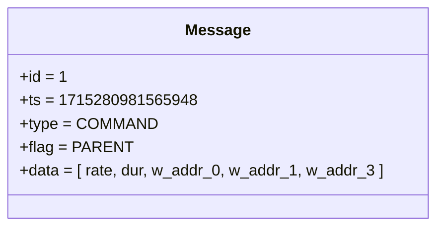

</div>

<div 
    alt="Seq"
    style="transform: scale(0.8)"
    class="absolute left-13% bottom-5%"
>

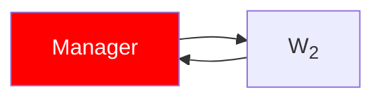

</div>

::right::

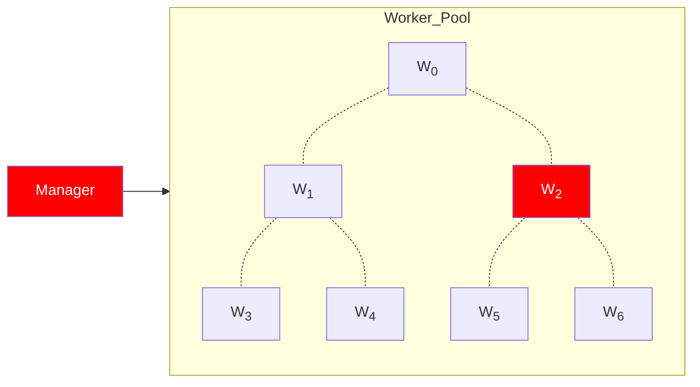

---
layout: two-cols-header
---

# Manager x Worker: Workflow [i = 2.1]

- <span style="color:#0070C0;font-style:bold;">ACTION: ROOT</span>
1. Connects to workers/children
2. Commands worker to be _Child_
    1. Starts Job: `./child <args`
3. Starts Job: `./parent <args`

<div
    alt="StepQ"
    style="transform: scale(0.6)"
    class="absolute top--5 left-30% right-0 bottom-0"
>

</div>

<div
    alt="Pool"
    style="transform: scale(0.6)"
    class="absolute top--5 left-60% right-0 bottom-0"
>


</div>

::left::

<div 
    alt="Message"
    style="transform: scale(0.8)"
>

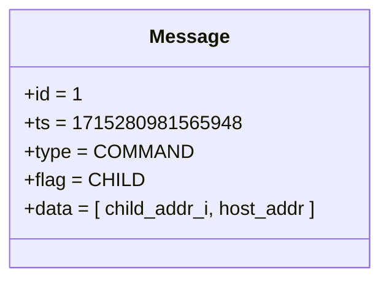

</div>

<div 
    alt="Seq"
    style="transform: scale(0.8)"
    class="absolute left-13% bottom-5%"
>

```mermaid
graph LR
    P[<font color=white>Parent]
    C["C<sub>i</sub>"] 

    P --> C
    C --> P

    style P fill:#FF0000
```

</div>

::right::

<div 
    alt="ManagerxWorker"
    style="transform: scale(1.1)"
    class="absolute top-35% right-16%"
>
```mermaid
graph LR 
    M[<font color=white>Manager]
    style M fill:#FF0000
    subgraph Worker_Pool
        direction TB
        W0["W<sub>0</sub>"] 
        W1["W<sub>1</sub>"]
        W2["<font color=white>W<sub>2</sub>"]
        W3["W<sub>3</sub>"]
        W4["W<sub>4</sub>"]
        W5["W<sub>5</sub>"]
        W6["W<sub>6</sub>"]

        style W0 fill:#00FF00
        style W1 fill:#00FF00
        style W3 fill:#00FF00
        style W2 fill:#FF0000

        W0 -.- W1
        W0 -.- W2

        W1 -.- W3
        W1 -.- W4

        W2 -.- W5
        W2 -.- W6

    end
    M --> Worker_Pool
```

</diV>

<div 
    alt="Parent_x_Children"
    style="transform: scale(0.8)"
    class="absolute top-65% right-13%"
>
```mermaid
graph LR
    subgraph Parent_x_Children
        direction TB
        P[<font color=white>P]
        style P fill:#FF0000

        C0["C<sub>0</sub>"] 
        C1["C<sub>1</sub>"]
        C3["C<sub>3</sub>"]

        style C0 fill:#00FF00
        style C1 fill:#00FF00
        style C3 fill:#00FF00

        P --> C0
        P --> C1
        P --> C3
    end
```
</diV>

---
layout: two-cols-header
---

# Manager x Worker: Jobs

- Manager and Workers inherit Node Class
- Nodes own jobs, mapped via a dictionary of threads
- `exec_job(j:Job)`: 
    - Runs `j.command` in separate thread
    - stores thread handler in dict
    - thread ultimately modifies the overloaded Job

<div 
    alt="Node"
    style="transform: scale(1.0)"
    class="absolute top-15% right-10%"
>

```mermaid
classDiagram
    class Node{
            +string ip
            +int port
            +dict jobs: thread -> Job

            +recv_message()
            +send_message(m:Message)
            +exec_job(j:Job)
            +find_job(j:Job)
            +check_jobs()
    }

    class Manager{
    }

    class Worker{
    }

    class Job{
            +string: id
            +string: addr

            +string command
            +int: ret
            +bool: end
            +string: output
            +list: dependencies

            +to_arr() -> char[]
            +from_arr(char[])
    }


    Node --|> Manager
    Node --|> Worker

    style Job fill:#000000,color:#fff
```

</div>

<div 
    alt="Node"
    style="transform: scale(1.0)"
    class="absolute bottom-7% right-10%"
>

```mermaid
block-beta
    N("Node"):1
    space
    J("<font color=white>Jobs"):1
    block:jobs
        columns 1
        A["T1 => J1"] 
        B["T2 => J2"] 
        C["T3 => J3"] 
    end

    N --> J

    style J fill:#000000
```

</div>

<div 
    alt="Message"
    style="transform: scale(0.8)"
    class="absolute left-15% bottom-5%"
>

```mermaid
classDiagram
    class Message{
            +id   = 4
            +ts   = 1715280981565948
            +type = REPORT/ACK
            +flag = NONE
            +data = [ Job ]
    }
    %% style Message fill:#0070C0,color:#fff
```

</div>

<TUMLogo variant="white" />

---
layout: two-cols-header
---

# Manager x Worker: Workflow [i = 2.2]

- <span style="color:#0070C0;font-style:bold;">ACTION: ROOT</span>

1. Manager: Tells root to be _Parent_
2. Parent: 
    1. Creates required Parent Job 
    2. Contacts Children
    3. Append their Jobs as dependencies
    4. Execs and Replies with Parent Job
3. Manager: Starts Timer Job _(1.2 * duration)_

<div
    alt="StepQ"
    style="transform: scale(0.6)"
    class="absolute top--5 left-30% right-0 bottom-0"
>
```mermaid
block-beta
    Q("<font color=white>StepQ")
    space
    block:items
        columns 1
        A["<del>CONN</del>"] 
        B["<del>ROOT</del>"] 
        C["RPRT"]
    end

    Q --> items

    style Q fill:#FF0000
```
</div>

<div
    alt="Pool"
    style="transform: scale(0.6)"
    class="absolute top--5 left-60% right-0 bottom-0"
>

```mermaid
block-beta
    P("<font color=white>Pool ")
    space
    block:workers
        columns 3
        W0["W<sub>0</sub>"] 
        W1["W<sub>1</sub>"]
        W2["<font color=black>W<sub>2</sub>"]
        W3["W<sub>3</sub>"]
        W4["W<sub>4</sub>"]
        W5["W<sub>5</sub>"]
        W6["W<sub>6</sub>"]
    end
    P-->workers
    style P fill:#0070C0
    style W2 fill:#000000
```
</div>

::left::

<div 
    alt="Message"
    style="transform: scale(0.8)"
    class="absolute left-10% bottom-0%"
>

```mermaid
classDiagram
    class Message{
            +id   = 1
            +ts   = 1715280981565948
            +type = ACK
            +flag = NONE
            +data = [ Job ]
    }
```

</div>

::right::

<div
    alt="Seq"
    style="transform: scale(1.2)"
    class="absolute right-17% top-40%"
>

```mermaid
sequenceDiagram
    participant M as Manager
    participant P as Parent
    participant C as Child

    M->>P: COMM=PARENT
    P->>C: COMM=CHILD
    C->>P: JOB[C]
    P->>M: JOB[P]
```
</div>

<div
    alt="NodeJobs"
    style="transform: scale(1.1)"
    class="absolute right-17% bottom-5%"
>

```mermaid
block-beta
    columns 3
    M("Manager"):1
    space
    MJ("J<sub>0</sub> = sleep(dur * 1.2)"):1

    M --> MJ

    P("Parent"):1
    space
    PJ("J<sub>0</sub> = ./parent [args] "):1

    P --> PJ

    C("Child"):1
    space
    CJ("J<sub>0</sub> = ./child [args] "):1

    C --> CJ

    style MJ fill:#000000;color:#FFFFFF
    style PJ fill:#000000;color:#FFFFFF
    style CJ fill:#000000;color:#FFFFFF
```

</div>

---
layout: two-cols-header
---

# Manager x Worker: Workflow [i = 3]

- <span style="color:#0070C0;font-style:bold;">ACTION: REPORT</span>

1. Looks for available jobs
2. Either: 
- If jobs still running: Pushes `Step=REPORT`
- Else: 
    - Pop Job from dict 
    - Looks at Job dependencies

<div
    alt="StepQ"
    style="transform: scale(0.6)"
    class="absolute top--5 left-30% right-0 bottom-0"
>
```mermaid
block-beta
    Q("<font color=white>StepQ")
    space
    block:items
        columns 1
        A["<del>CONN</del>"] 
        B["<del>ROOT</del>"] 
        C["<del>RPRT</del>"] 
    end

    Q --> items

    style Q fill:#FF0000
```
</div>

<div
    alt="Pool"
    style="transform: scale(0.6)"
    class="absolute top--5 left-60% right-0 bottom-0"
>

```mermaid
block-beta
    P("<font color=white>Pool ")
    space
    block:workers
        columns 3
        W0["W<sub>0</sub>"] 
        W1["W<sub>1</sub>"]
        W2["<font color=black>W<sub>2</sub>"]
        W3["W<sub>3</sub>"]
        W4["W<sub>4</sub>"]
        W5["W<sub>5</sub>"]
        W6["W<sub>6</sub>"]
    end
    P-->workers
    style P fill:#0070C0
    style W2 fill:#000000
```
</div>

