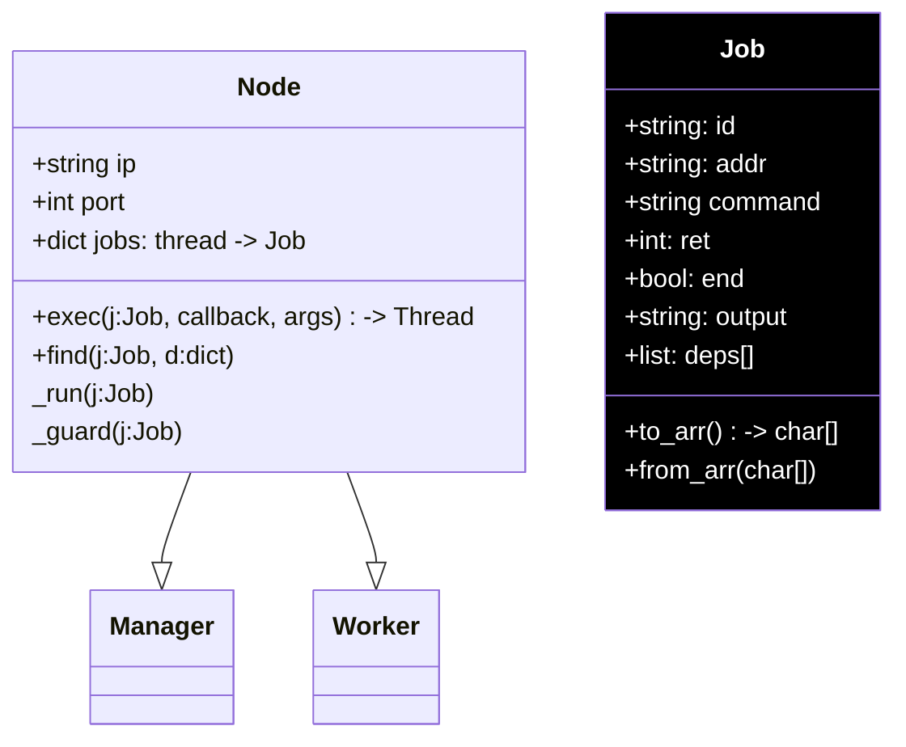

```mermaid
block-beta
    N("Node"):1
    space
    block:G
        columns 2
        J("<font color=white>Jobs"):1
        block:jobs
            columns 1
            A["T1 => J1"] 
            B["T2 => J2"] 
        end
        Guard("<font color=white>Guards"):1
        block:guards
            columns 1
            C["T1 => J0"] 
            D["--------"] 
        end
    end

    N --> G

    style J fill:#000000
    style Guard fill:#000000
```

# Manager x Worker: Data Structures

- Manager and Workers inherit Node Class
- Nodes own jobs, mapped via a dictionary of threads
- `exec(j:Job)`: 
    - Runs `j.command` in separate thread and returns handler
    - Thread ultimately modifies overloaded Job

<TUMLogo variant="white" />
