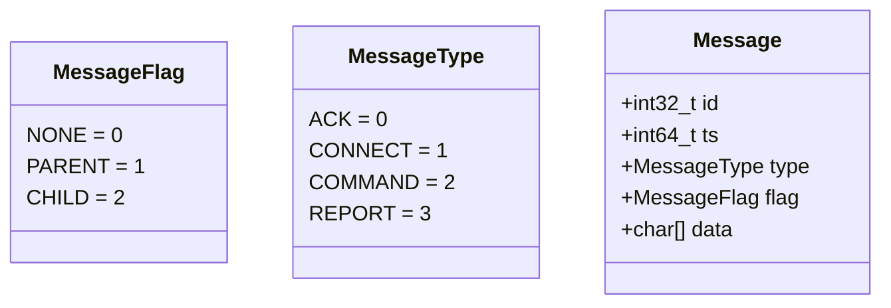
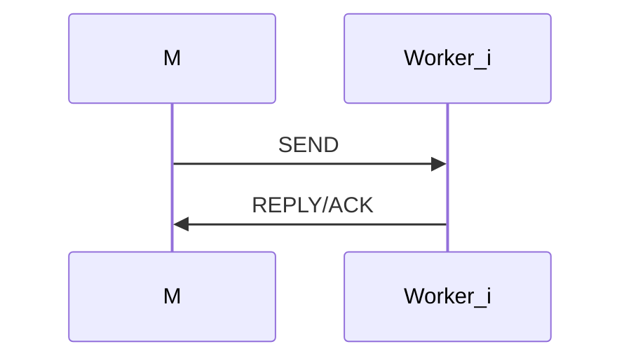

# Manager x Worker: Communication

- ZMQ Sockets
- Pairwise send and reply initiated by Manager
- Manager: ZMQ_REQ 
- Worker:  ZMQ_REP

::left::

```mermaid
classDiagram
    class MessageFlag{
        NONE = 0 
        PARENT = 1 
        CHILD = 2 
    }

    class MessageType{
        ACK = 0 
        CONNECT = 1 
        COMMAND = 2 
        REPORT = 3
    }

    class Message{
            +int32_t id
            +int64_t ts
            +MessageType type
            +MessageFlag flag
            +char[] data
    }
    %% style Message fill:#0070C0,color:#fff
```

::right::

```mermaid
sequenceDiagram
    participant M
    participant W as Worker_i

    M->>W: SEND
    W->>M: REPLY/ACK
```

<TUMLogo variant="white" />
