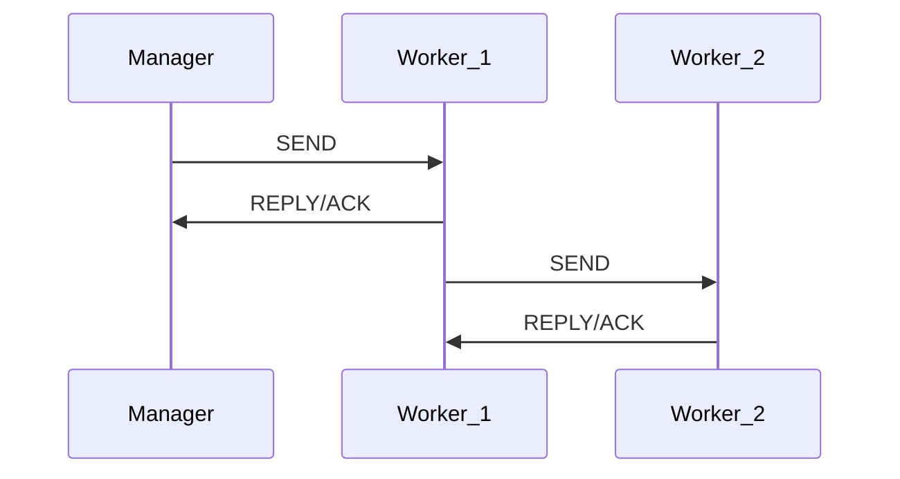
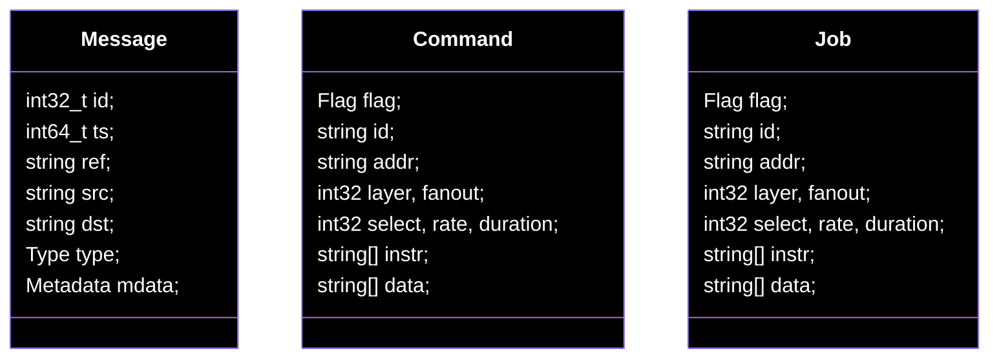

# Tree-Finder: Communication

- (De)Serialization: Protobufs
- ZMQ Sockets
- Pairwise send and reply:
    - Manager: `ZMQ_REQ` 
    - Worker:  `ZMQ_REP` & `ZMQ_REQ`

```mermaid
sequenceDiagram
    participant M as Manager
    participant W1 as Worker_1
    participant W2 as Worker_2

    M->>W1: SEND
    W1->>M: REPLY/ACK

    W1->>W2: SEND
    W2->>W1: REPLY/ACK
```

```mermaid
classDiagram
    class Message{
            int32_t id;
            int64_t ts;
            string ref;
            string src;
            string dst;
            Type type;
            Metadata mdata;
    }

    class Command{
        Flag flag;
        string id;
        string addr;
        int32  layer, fanout;
        int32  select, rate, duration;
        string[] instr;
        string[] data;
    }

    class Job{
        Flag flag;
        string id;
        string addr;
        int32  layer, fanout;
        int32  select, rate, duration;
        string[] instr;
        string[] data;
    }


    style Message fill:#000000,color:#fff
    style Command fill:#000000,color:#fff
    style Job     fill:#000000,color:#fff
```

<TUMLogo variant="white" />
