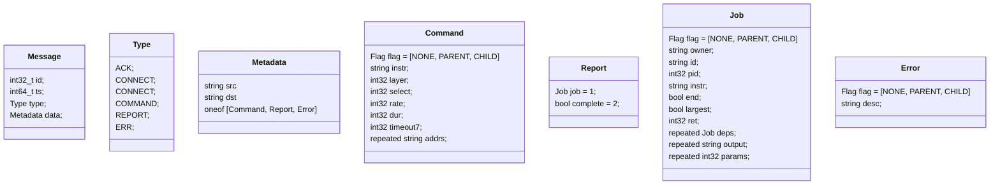
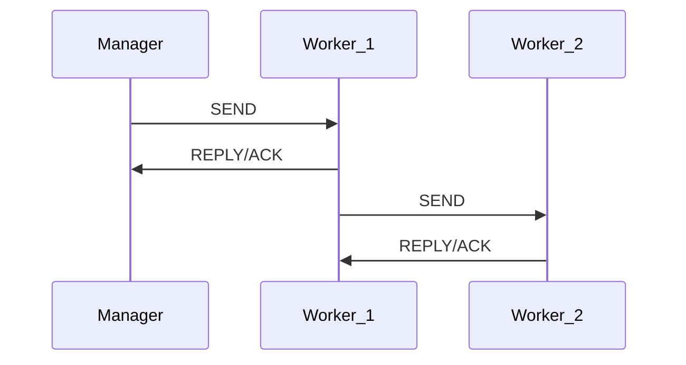

# Manager x Worker: Communication

- ZMQ Sockets
- Pairwise send and reply initiated by Manager
- Manager: ZMQ_REQ 
- Worker:  ZMQ_REP

```mermaid
classDiagram
    class Message{
            int32_t id;
            int64_t ts;
            Type type;
            Metadata data;
    }

    class Type{
            ACK; 
            CONNECT;
            CONNECT;
            COMMAND;
            REPORT;
            ERR;
    }

    class Metadata{
        string src
        string dst
        oneof [Command, Report, Error]
    }


    class Command{
        Flag flag = [NONE, PARENT, CHILD]
        string instr;
        int32 layer;
        int32 select;
        int32 rate;
        int32 dur;
        int32 timeout7;
        repeated string addrs;
    }

    class Report{
        Job job = 1;
        bool complete = 2;
    }

    class Job{
        Flag flag = [NONE, PARENT, CHILD]
        string owner;
        string id;
        int32 pid;
        string instr;
        bool end;
        bool largest;
        int32 ret;
        repeated Job deps;
        repeated string output;
        repeated int32 params;
    }

    class Error{
        Flag flag = [NONE, PARENT, CHILD]
        string desc;
    }

    %% style Message fill:#0070C0,color:#fff
```

```mermaid
sequenceDiagram
    participant M as Manager
    participant W1 as Worker_1
    participant W2 as Worker_2

    M->>W1: SEND
    W1->>M: REPLY/ACK

    W1->>W2: SEND
    W2->>W1: REPLY/ACK
```

<TUMLogo variant="white" />
