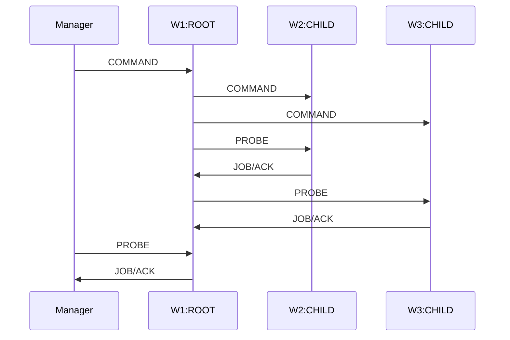
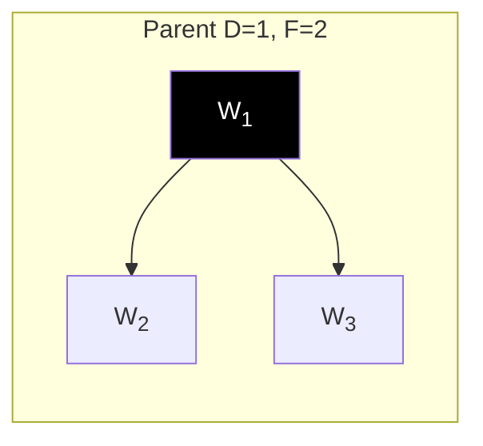
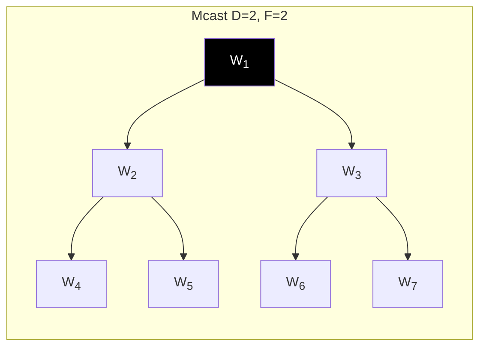
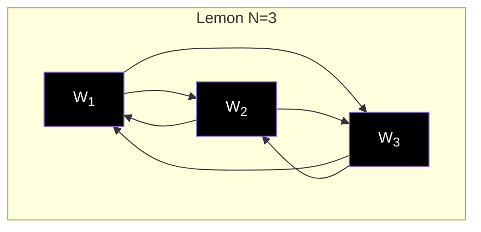
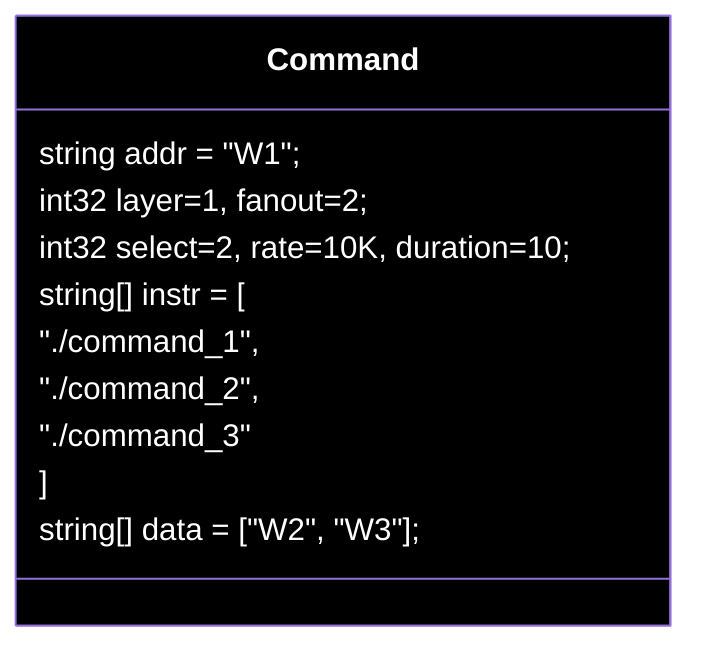

# Tree-Finder: Jobs/Tasks

- Nodes send/recv Messages
- Manager deploys Jobs { Parent, Mcast, Lemon }
- Data-Structures describe: 
    - Node's Command 
    - Node's Tree Position
- Manager aggregates results

<!-- 

<!--     alt="sequenceDiagram" -->
<!--     style="transform: translate(-50%, -50%) scale(1.2)" -->
<!--     class="absolute top-75% left-50%" -->
<!-- > -->

<TUMLogo variant="white" />
