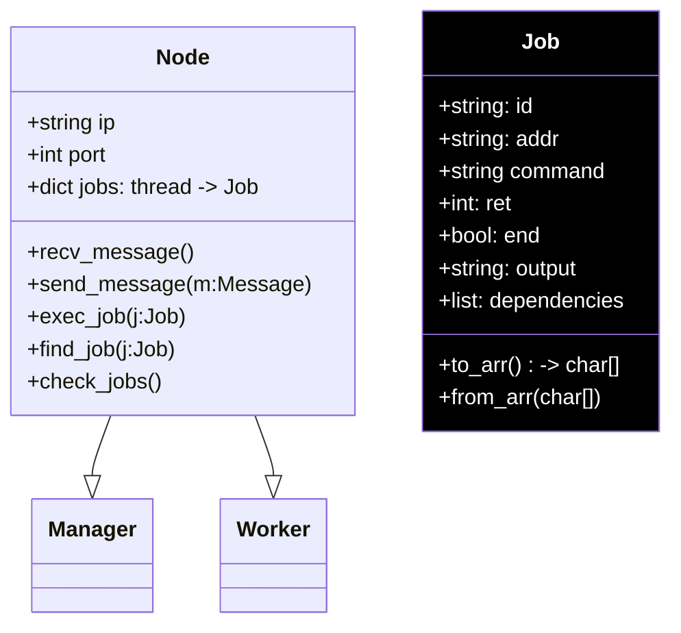
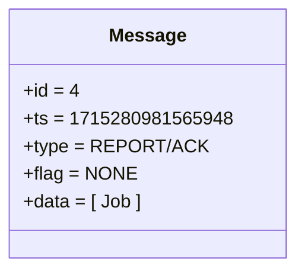

```mermaid
block-beta
    N("Node"):1
    space
    J("<font color=white>Jobs"):1
    block:jobs
        columns 1
        A["T1 => J1"] 
        B["T2 => J2"] 
        C["T3 => J3"] 
    end

    N --> J

    style J fill:#000000
```

# Manager x Worker: Jobs

- Manager and Workers inherit Node Class
- Nodes own jobs, mapped via a dictionary of threads
- `exec_job(j:Job)`: 
    - Runs `j.command` in separate thread
    - stores thread handler in dict
    - thread ultimately modifies the overloaded Job

<TUMLogo variant="white" />
