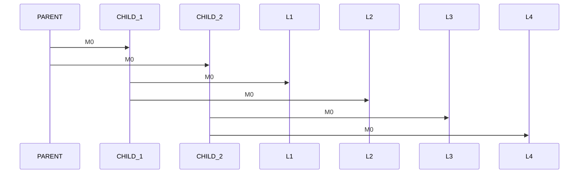

# MCAST Tree Performance

- Root: 
    - Sends messages to children
- Proxies: 
    - Forwards messages from parent to children
- Leaves: 
    - Stores latency difference
    - prints to `stdout` 90% percentile latency

<div 
    alt="WorkerSM"
    style="transform: scale(1.9)"
    class="absolute bottom-10% left-20%"
>


</div>

::left::

<div 
    alt="cpp"
    style="transform: scale(0.8)"
    class="absolute top-15% right-5%"
>

```cpp
typedef struct MsgUDP {
    uint32_t id;
    uint64_t ts;
} MsgUDP_t;

double get_percentile(const std::vector<int64_t>& data, 
                      double percentile) {
    // stuff 
}

```

</div>

<TUMLogo variant="white" />
