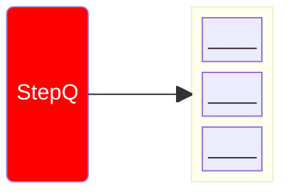
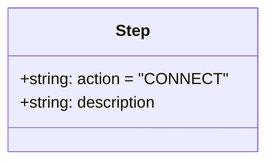

# Manager State Machine

- Manager actively sends requests to workers
- Fetches steps from `step_queue`
- Process steps based on action type

::left::

```python
while(True):
    step = self.pop_step()
    if not step: break
        match step["action"]:
            case "CONNECT": self.establish()
            case "ROOT":    self.root()
            case "REPORT":  self.report()
            case _:         raise RuntimeError()
```

::right::

<div
    alt="StepQ"
    style="transform: scale(0.6)"
    class="absolute top--5 left-50% right-0 bottom-0"
>

</div>

<div
    alt="StepClass"
    style="transform: scale(0.6)"
    class="absolute top--5 left-70% right-0 bottom-0"
>


</div>


<TUMLogo variant="white" />
