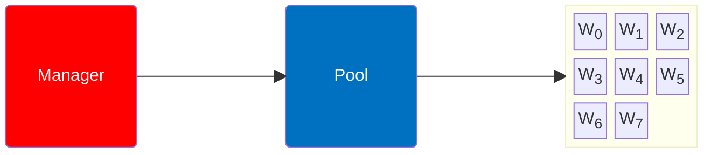
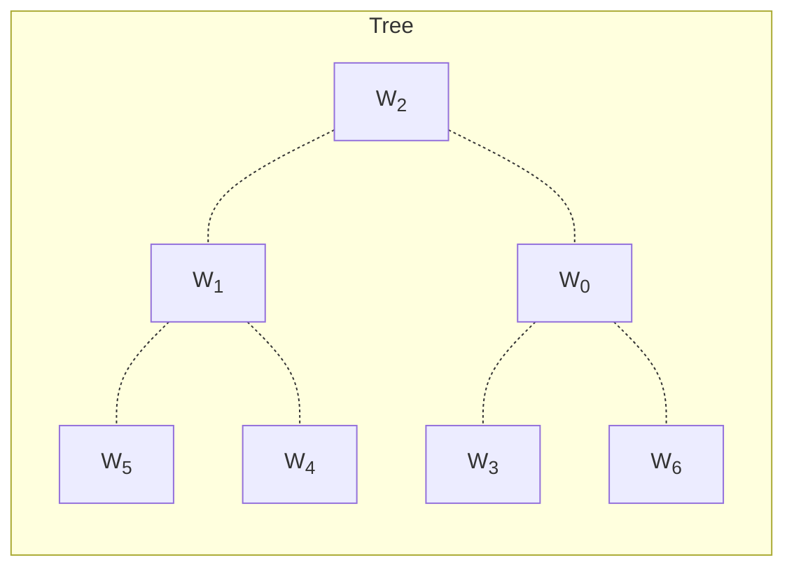

```mermaid
graph LR 
    C[<font color=white>CONN]
    R[<font color=white>ROOT]
    P[<font color=white>MCST]

    C --> R
    R --> R
    R --> P
    P --> R

    style C fill:#000000
    style R fill:#000000
    style P fill:#000000
```

# Summary

1. Establish connection to workers
2. Do for [ `best`, `worst`, `random`] trees:
    1. Choose `root`
    2. Until Tree is complete
        1. Start `parent x child` jobs
        2. Probe for results
        3. When done: modify `Tree` and `Pool` accordingly
    2. Store results

<TUMLogo variant="white" />
