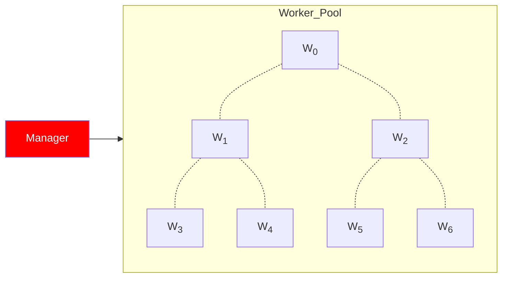

# Testbench and Heuristic

::left::
1. Allocate __N__ VMs.
2. Run Jasper on Vanilla Setup
    1. Terminate
    1. Store Results
3. Apply Proposed Heuristic

::right::

```mermaid
graph LR
    M[<font color=white>Manager]
    style M fill:#FF0000
    subgraph Worker_Pool
        direction TB
        W0["W<sub>0</sub>"] 
        W1["W<sub>1</sub>"]
        W2["W<sub>2</sub>"]
        W3["W<sub>3</sub>"]
        W4["W<sub>4</sub>"]
        W5["W<sub>5</sub>"]
        W6["W<sub>6</sub>"]

        W0 -.- W1
        W0 -.- W2

        W1 -.- W3
        W1 -.- W4

        W2 -.- W5
        W2 -.- W6

    end
    M --> Worker_Pool
```

<TUMLogo variant="white" />
