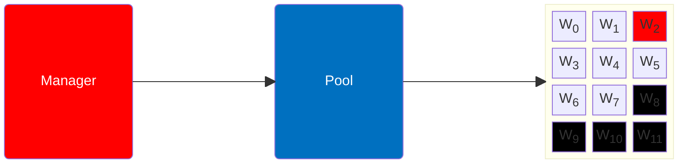
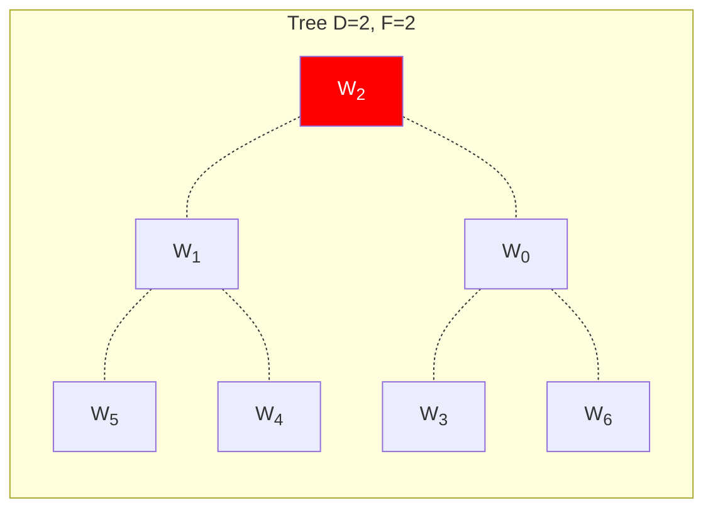

# Tree-Finder: Testbench and Heuristic

1. Allocate __N__ VMs.
2. Apply Proposed Heuristic 
3. Apply Lemon-Drop
4. Evaluate Multicast Performances: 
    - Vanilla x Heuristic x LemonDrop

<TUMLogo variant="white" />
