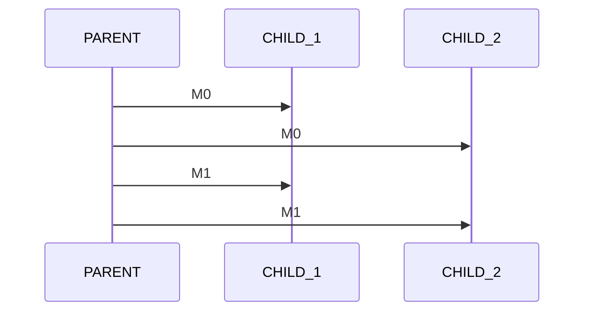

# Parent x Child UDP

- Parent sends messages to multiple children
- Child: 
    - Waits for stream start 
    - Stores latency difference
    - prints to `stdout` 90% percentile latency

<div 
    alt="WorkerSM"
    class="absolute top-15% left-50% right-0 bottom-0"
>


</div>

::left::

<div 
    alt="cpp"
    style="transform: scale(0.8)"
    class="absolute bottom--4% left-5%"
>

```cpp
typedef enum MsgType {
    START = 0,
    ONGOING = 1,
    END = 2
} MsgType_t;

typedef struct MsgUDP {
    uint32_t id;
    uint64_t ts;
    MsgType_t type;
    uint64_t dur;
    uint64_t rate;
} MsgUDP_t;

double get_percentile(const std::vector<int64_t>& data, 
                      double percentile) {
    // stuff 
}

```

</div>

<TUMLogo variant="white" />
