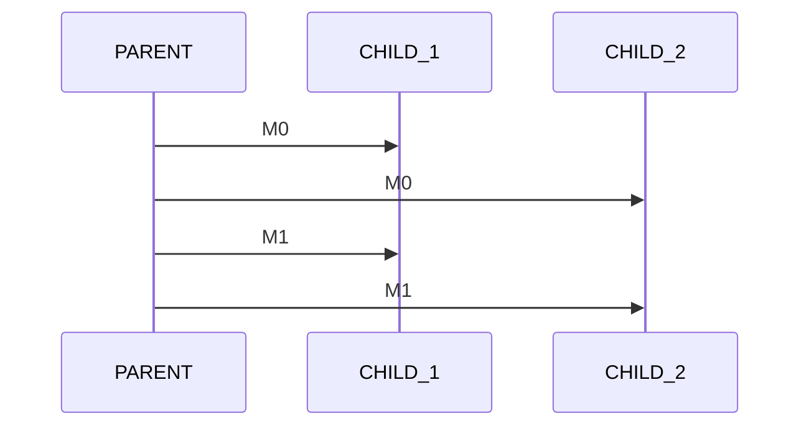

# Parent x Child Job

- Parent sends messages to multiple children
- Child: 
    - Waits for stream start 
    - Stores latency difference per Message

<div 
    alt="WorkerSM"
    class="absolute bottom-10% left-10%"
>


</div>

::left::

<div 
    alt="cpp"
    style="transform: scale(0.8)"
    class="absolute top-15% right-5%"
>

```cpp
typedef struct MsgUDP {
    uint32_t id;
    uint64_t ts;
} MsgUDP_t;

```

</div>

<TUMLogo variant="white" />
