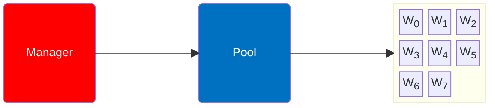
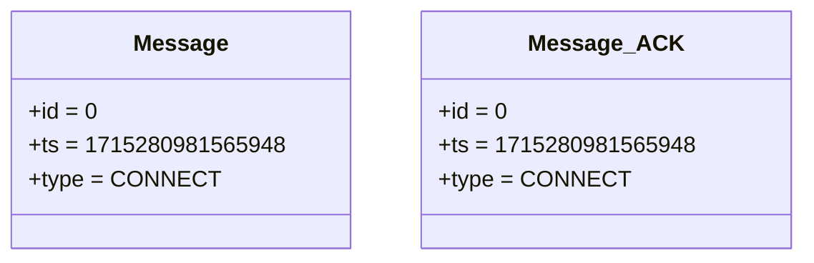

```mermaid
graph LR 
    M[<font color=white>Manager]
    style M fill:#FF0000
    subgraph Tree
        direction TB
        W0["<font color=black>W<sub>0</sub>"]
        W1["<font color=black>W<sub>1</sub>"]
        W2["<font color=black>W<sub>2</sub>"]
        W3["<font color=black>W<sub>3</sub>"]
        W4["<font color=black>W<sub>4</sub>"]
        W5["<font color=black>W<sub>5</sub>"]
        W6["<font color=black>W<sub>6</sub>"]

        W0 -.- W1
        W0 -.- W2

        W1 -.- W3
        W1 -.- W4

        W2 -.- W5
        W2 -.- W6

        style W0 fill:#000000
        style W1 fill:#000000
        style W2 fill:#000000
        style W3 fill:#000000
        style W4 fill:#000000
        style W5 fill:#000000
        style W6 fill:#000000
    end
    M --> Tree
```

# Manager x Worker: Workflow [Step_i = 1]

- ACTION: CONNECT
1. Loops through all workers
    1. Establishes connection
    2. `Send()` CONNECT Messages
    3. `Recv()` ACK Messages
    4. Disconnects

```mermaid
block-beta
    J("<font color=white>Jobs")
    space
    block:items
        columns 1
        A["____"] 
        B["____"] 
    end

    J --> items

    style J fill:#000000
```

::left::

::right::

<TUMLogo variant="white" />
