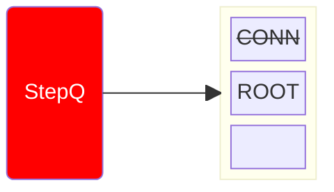
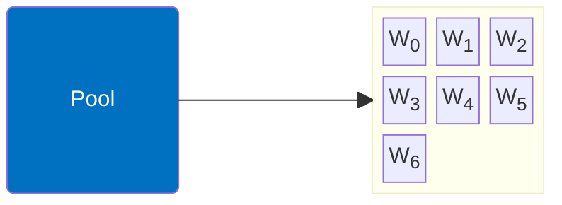
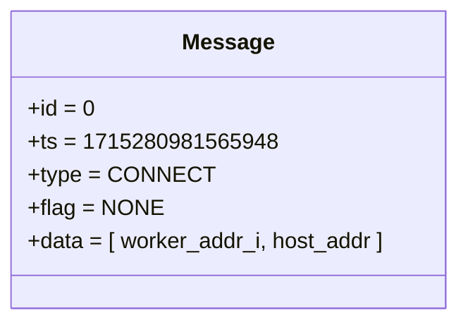
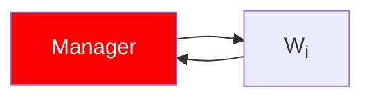
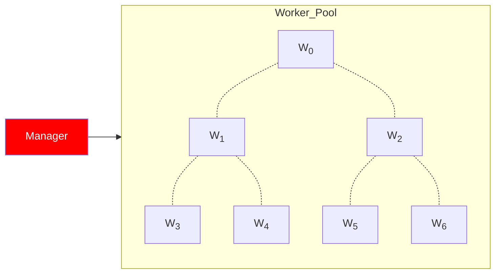

# Manager x Worker: Workflow [i = 1]

- ACTION: CONNECT
1. Loops through all workers
    1. Establishes connection 
    2. Sends/Receives CONNECT/ACK Messages
    3. Disconnects

::left::

::right::

<TUMLogo variant="white" />
