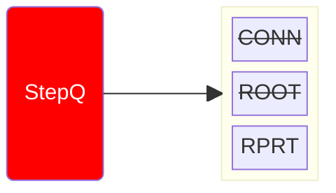
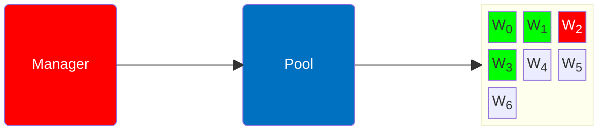
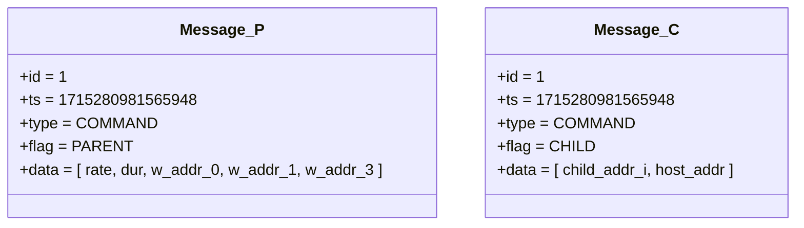
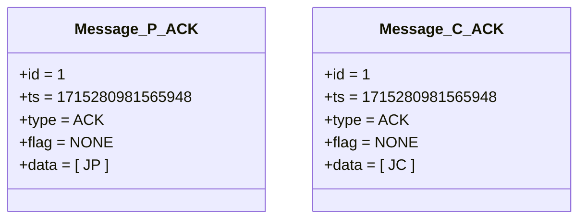
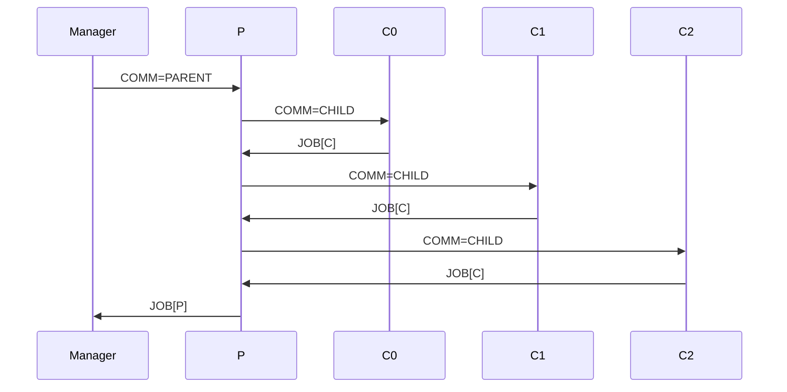

# Manager x Worker: Workflow [Step_i = 2.1]

- ACTION: ROOT
1. Select root from pool ( idx=2 )
2. Commands Root/Parent: `./parent <args`
    1. Commands children: `./child <args`
    2. Store their Jobs `JC`
    3. Starts Job `JP` and returns it via ACK
3. Pushes: `Step=REPORT` and stores `JP`

```mermaid
block-beta
    J("<font color=white>Jobs")
    space
    block:items
        columns 1
        A["JP  "] 
        B["____"] 
        X["____"] 
    end

    space
    block:pitems
        columns 1
        C["JP: ./parent [args]"] 
        D["____"] 
        Y["____"] 
    end

    space
    block:citems
        columns 1
        E["JC0: ./child [args]"] 
        F["JC1: ./child [args]"] 
        G["JC2: ./child [args]"] 
    end

    J --> items
    A --> C
    C --> E

    style J fill:#000000
```

::left::

::right::

<TUMLogo variant="white" />
