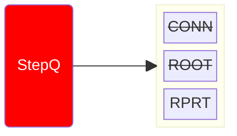
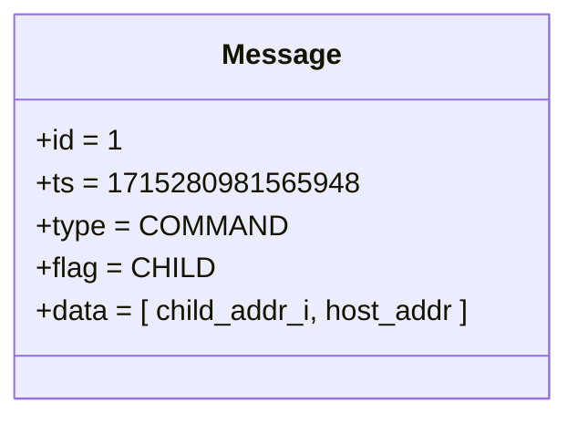
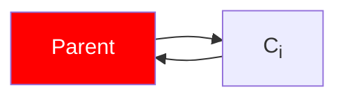
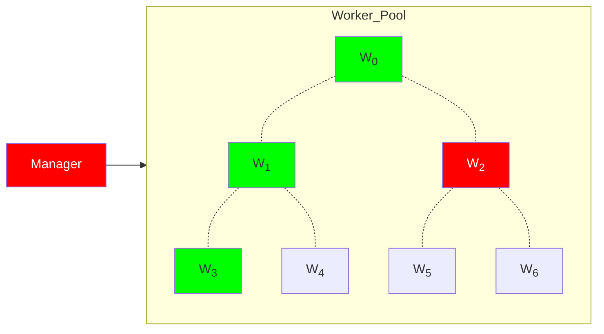
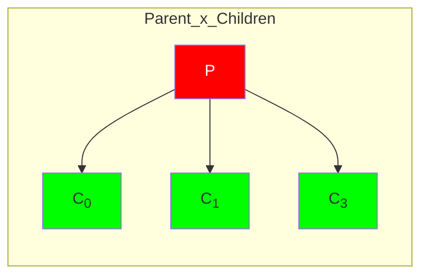

# Manager x Worker: Workflow [i = 2.1]

- ACTION: ROOT
1. Connects to workers/children
2. Commands worker to be _Child_
    1. Starts Job: `./child <args`
3. Starts Job: `./parent <args`

```mermaid
block-beta
    P("<font color=white>Pool ")
    space
    block:workers
        columns 3
        W0["W<sub>0</sub>"] 
        W1["W<sub>1</sub>"]
        W2["<font color=black>W<sub>2</sub>"]
        W3["W<sub>3</sub>"]
        W4["W<sub>4</sub>"]
        W5["W<sub>5</sub>"]
        W6["W<sub>6</sub>"]
    end
    P-->workers
    style P fill:#0070C0
    style W2 fill:#000000
```

::left::

::right::

<TUMLogo variant="white" />
