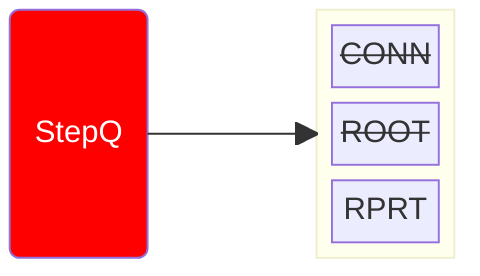
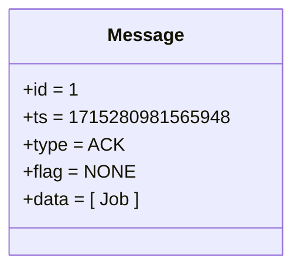
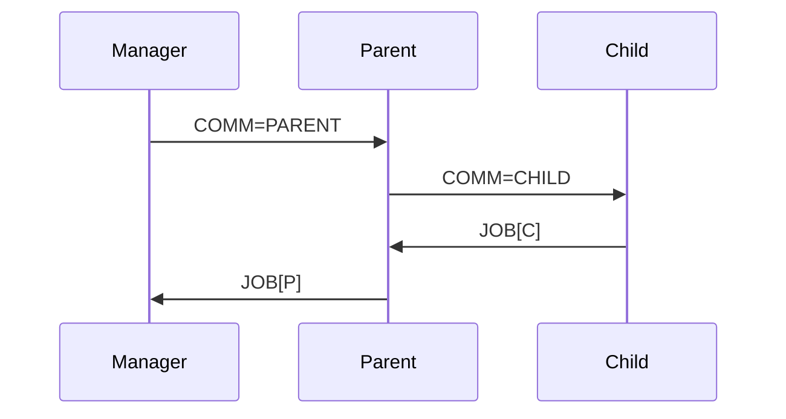

```mermaid
block-beta
    columns 3
    M("Manager"):1
    space
    MJ("J<sub>0</sub> = sleep(dur * 1.2)"):1

    M --> MJ

    P("Parent"):1
    space
    PJ("J<sub>0</sub> = ./parent [args] "):1

    P --> PJ

    C("Child"):1
    space
    CJ("J<sub>0</sub> = ./child [args] "):1

    C --> CJ

    style MJ fill:#000000;color:#FFFFFF
    style PJ fill:#000000;color:#FFFFFF
    style CJ fill:#000000;color:#FFFFFF
```

# Manager x Worker: Workflow [i = 2.2]

- ACTION: ROOT

1. Manager: Tells root to be _Parent_
2. Parent: 
    1. Creates required Parent Job 
    2. Contacts Children
    3. Append their Jobs as dependencies
    4. Execs and Replies with Parent Job
3. Manager: Starts Timer Job _(1.2 * duration)_

```mermaid
block-beta
    P("<font color=white>Pool ")
    space
    block:workers
        columns 3
        W0["W<sub>0</sub>"] 
        W1["W<sub>1</sub>"]
        W2["<font color=black>W<sub>2</sub>"]
        W3["W<sub>3</sub>"]
        W4["W<sub>4</sub>"]
        W5["W<sub>5</sub>"]
        W6["W<sub>6</sub>"]
    end
    P-->workers
    style P fill:#0070C0
    style W2 fill:#000000
```

::left::

::right::

<TUMLogo variant="white" />
