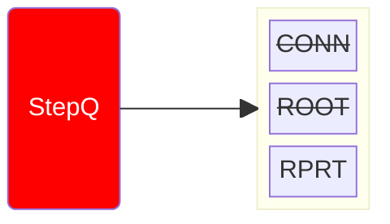
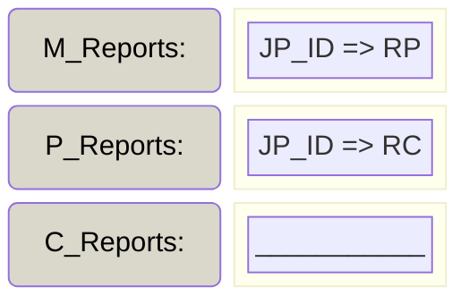
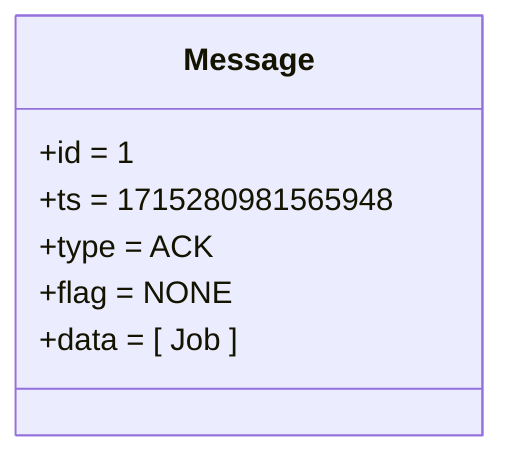
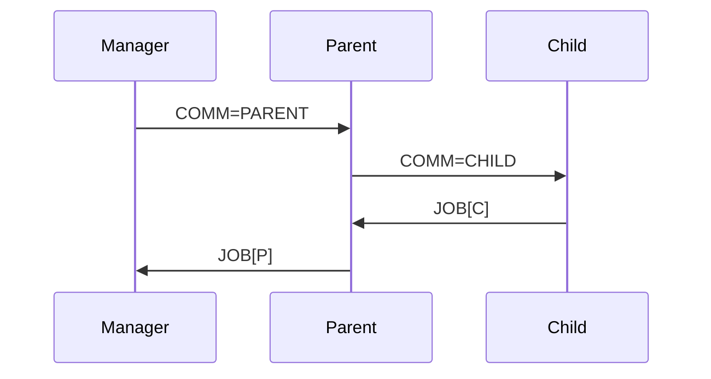

```mermaid
block-beta
    columns 2
    JM("<font color=white>M_Jobs:"):1
    block:mitems
        columns 1
        A["____"] 
    end

    JP("<font color=white>P_Jobs:"):1
    block:pitems
        columns 1
        B["JP: ./parent [args]"] 
    end

    JC("<font color=white>C_Jobs:"):1
    block:citems
        columns 1
        C["JC: ./child [args]"] 
    end

    style JM fill:#000000
    style JP fill:#000000
    style JC fill:#000000
```

# Manager x Worker: Workflow [i = 2.2]

- ACTION: ROOT

1. Manager: Tells root to be _Parent_
2. Parent: 
    1. Creates required Parent Job 
    2. Contacts Children, Get Child Job Structs
    3. Creates/Appends Reports
    4. Execs and Replies with Parent Job
3. Creates/Appends Report

```mermaid
block-beta
    P("<font color=white>Pool ")
    space
    block:workers
        columns 3
        W0["W<sub>0</sub>"] 
        W1["W<sub>1</sub>"]
        W2["<font color=black>W<sub>2</sub>"]
        W3["W<sub>3</sub>"]
        W4["W<sub>4</sub>"]
        W5["W<sub>5</sub>"]
        W6["W<sub>6</sub>"]
    end
    P-->workers
    style P fill:#0070C0
    style W2 fill:#000000
```

::left::

::right::

<TUMLogo variant="white" />
