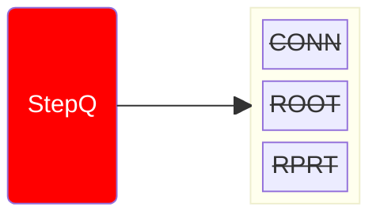

```mermaid
block-beta
    P("<font color=white>Pool ")
    space
    block:workers
        columns 3
        W0["W<sub>0</sub>"] 
        W1["W<sub>1</sub>"]
        W2["<font color=black>W<sub>2</sub>"]
        W3["W<sub>3</sub>"]
        W4["W<sub>4</sub>"]
        W5["W<sub>5</sub>"]
        W6["W<sub>6</sub>"]
    end
    P-->workers
    style P fill:#0070C0
    style W2 fill:#000000
```

# Manager x Worker: Workflow [i = 3]

- ACTION: REPORT

1. Looks for available jobs
2. Either: 
- If jobs still running: Pushes `Step=REPORT`
- Else: 
    - Pop Job from dict 
    - Looks at Job dependencies
    - Contact owners and ask for report

<TUMLogo variant="white" />
