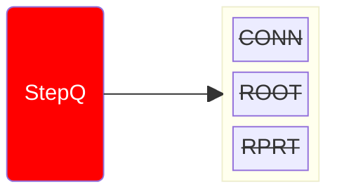
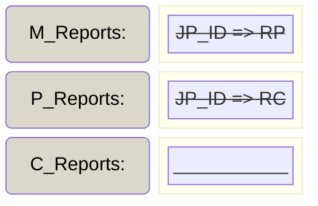
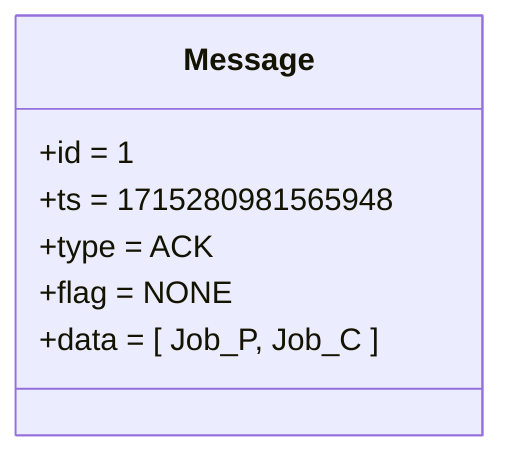
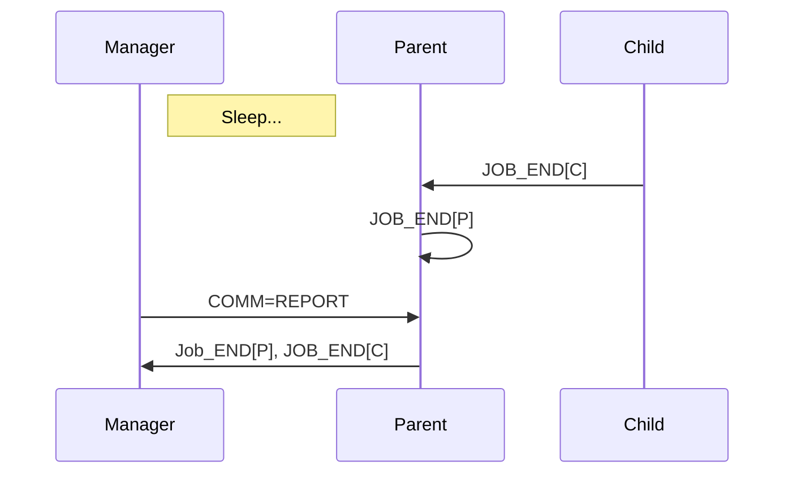

```mermaid
block-beta
    P("<font color=white>Pool ")
    space
    block:workers
        columns 3
        W0["W<sub>0</sub>"] 
        W1["W<sub>1</sub>"]
        W2["<font color=black>W<sub>2</sub>"]
        W3["W<sub>3</sub>"]
        W4["W<sub>4</sub>"]
        W5["W<sub>5</sub>"]
        W6["W<sub>6</sub>"]
    end
    P-->workers
    style P fill:#0070C0
    style W2 fill:#000000
```

```mermaid
block-beta
    columns 2
    JM("<font color=white>M_Jobs:"):1
    block:mitems
        columns 1
        A["____"] 
    end

    JP("<font color=white>P_Jobs:"):1
    block:pitems
        columns 1
        B["<del>JP: ./parent [args]</del>"] 
    end

    JC("<font color=white>C_Jobs:"):1
    block:citems
        columns 1
        C["<del>JC: ./child [args]</del>"] 
    end

    style JM fill:#000000
    style JP fill:#000000
    style JC fill:#000000
```

# Manager x Worker: Workflow [i = 3.0]

- ACTION: REPORT

1. Pops next report
2. Sleeps until trigger timestamp
3. Send pending job to owner (Report)
    1. Parent has received reports on children 
    2. Parent has also finished its job
    3. Parent sends back all job results

::left::

::right::

<TUMLogo variant="white" />
