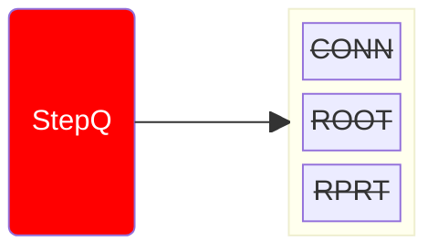
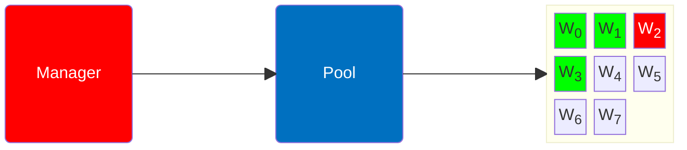
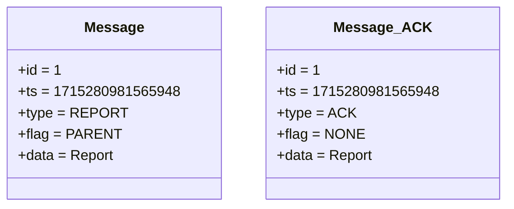
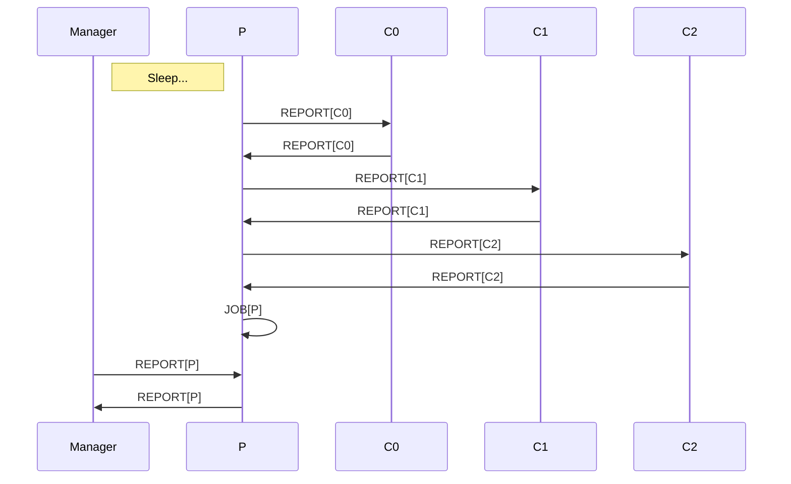

# Manager x Worker: Workflow [Step_i = 3.0]

- ACTION: REPORT

1. Pops next report
2. Sleeps until trigger timestamp
3. Probes report on pending job to owner
    1. Parent also probes for reports 
    2. Parent aggregates results and reports

```mermaid
block-beta
    J("<font color=white>Jobs")
    space
    block:items
        columns 1
        A["JP  "] 
        B["____"] 
        X["____"] 
    end

    space

    block:pitems
        columns 1
        C["JP: ./parent [args]"] 
        D["____"] 
        Y["____"] 
    end

    space
    block:citems
        columns 1
        E["JC0: ./child [args]"] 
        F["JC1: ./child [args]"] 
        G["JC2: ./child [args]"] 
    end

    J --> items
    A --> C
    C --> E

    style J fill:#000000
```

::left::

::right::

<TUMLogo variant="white" />
