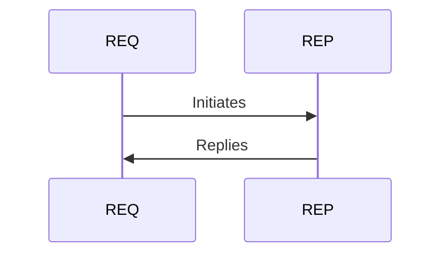

# ZMQ Sockets

- ZMQ_REQ/ZMQ_REP
    - Send/Receiver order has to be respected
    - Reply remembers only last received address
- Other Sockets:
    - Push/Pull 
    - Pub/Sub 
    - Pair/Pair
    - Router/Dealer

<TUMLogo variant="white" />
